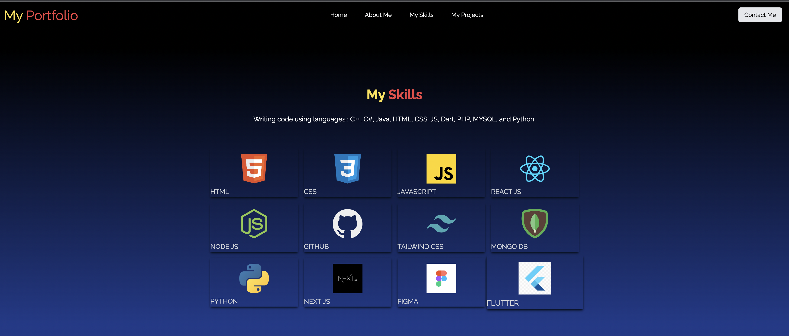
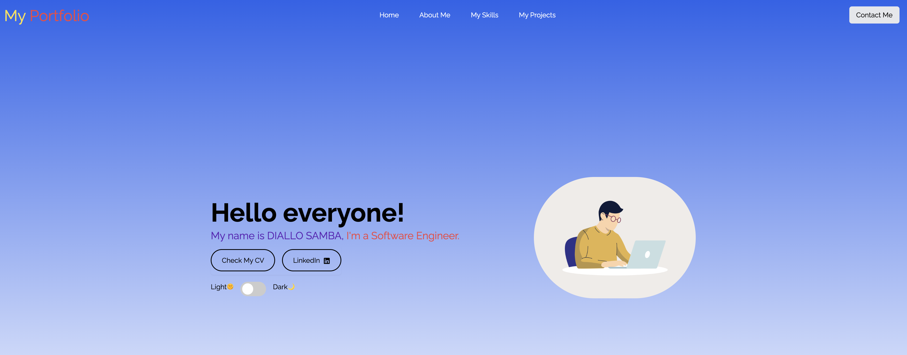
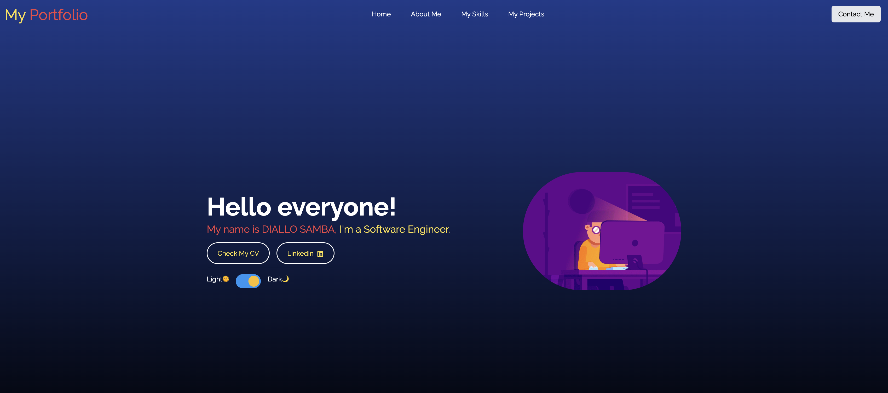
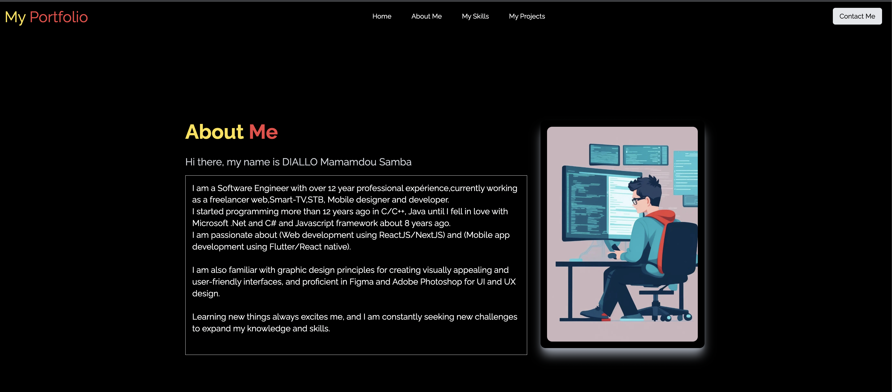
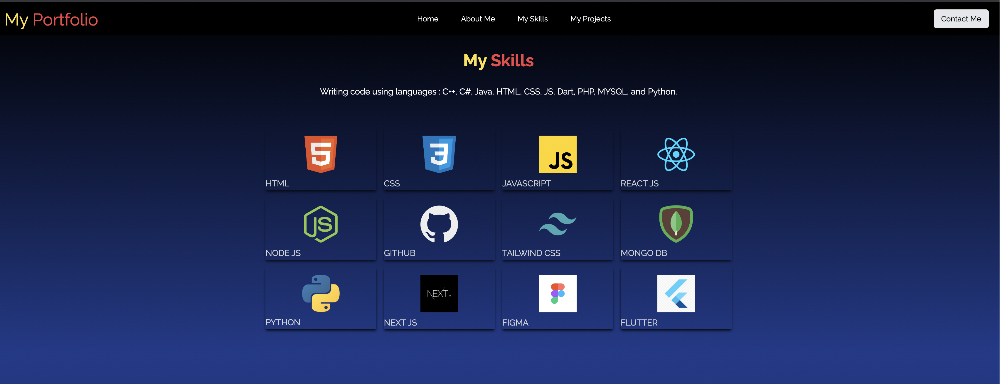
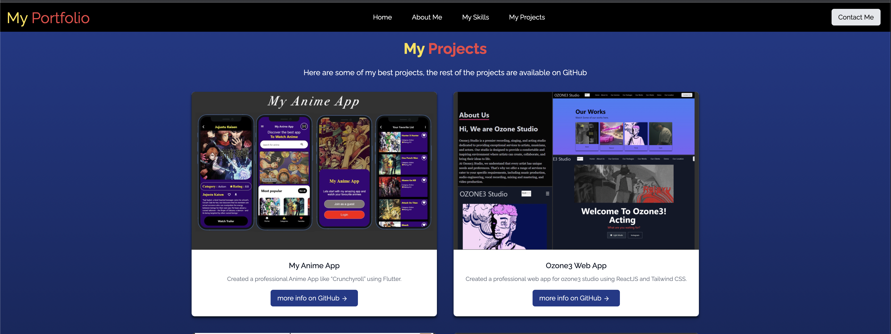
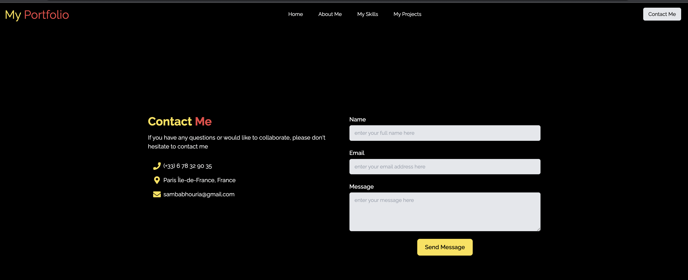

# My Portfolio

This project was bootstrapped with [Create React App](https://github.com/facebook/create-react-app).

# Project Description

Welcome to my professional portfolio website, designed and developed using React JS and Tailwind CSS. This website is a showcase of my skills, experience, and projects, and is a testament to my commitment to quality and attention to detail.

With 5 distinct pages, including Home, About Me, My Skills, My Projects, and a Contact Form, this website provides a comprehensive overview of my professional profile. The Home page is designed to make a lasting first impression with its sleek, modern design and user-friendly interface. The About Me page provides a quick overview of my skills, experience, and achievements, giving potential clients and employers an insight into my professional background.

The My Skills page is an in-depth exploration of the technical skills and knowledge that I possess, while the My Projects page showcases some of my best work and demonstrates my ability to deliver high-quality results. The Contact Form is a real contact form that has been created with the help of emailjs, allowing visitors to connect with me directly and securely. Additionally, this website features both light and dark modes, making it accessible and visually appealing to all users.

# 🚀 Screen Shots

# 🚀 Folder Structure

└── myrealstate/
├── src/
| ├── components/
| └── ├── assets/
| └── ├── pages/
| └── About.js
| └── Contact.js
| └── Home.js
| └── Projects.js
| └── Skills.js
| └── home.css
| └── PageLoader.js
| └── Navbar.js
| └── Footer.js
└── App.css
└── App.js
└── index.css
└── index.js

// https://www.emailjs.com/docs/tutorial/adding-email-service/
